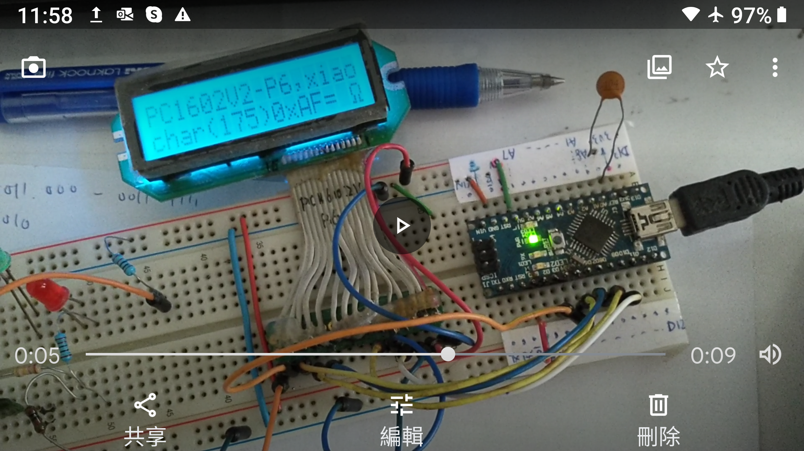

# AVR_LCD44780_PC1602V2-P6_ohm_symbol
testing program to reveal ohm symbol, PC1602V2-P6 is HD44780 compatible but char ROM has difference

Arduino Nano used.

### hardware wiring
// LCM1602 pin name vs Arduino NANO GPIO pin#
//const int rs = 8, en = 7, d4 = 6, d5 = 5, d6 = 4, d7 = 3;
//LiquidCrystal lcd(rs, en, d4, d5, d6, d7);
LiquidCrystal   lcd(8,  7,  6 , 5,  4,  3 );

### result
char(175) is displayed as ohm synbol  
  

### simliar testing/project,
https://xiaolaba.wordpress.com/2013/05/13/dscf5143-lcd-char-map-test/  
https://xiaolaba.wordpress.com/2021/05/27/lcm-lcd-powertip-pg12832a-p6-almost-compatible-with-pc1602v-p6-or-hd44780/  
